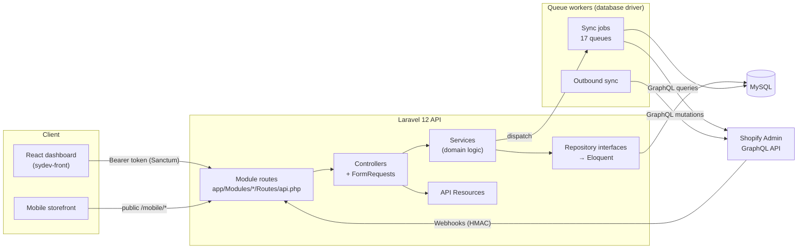
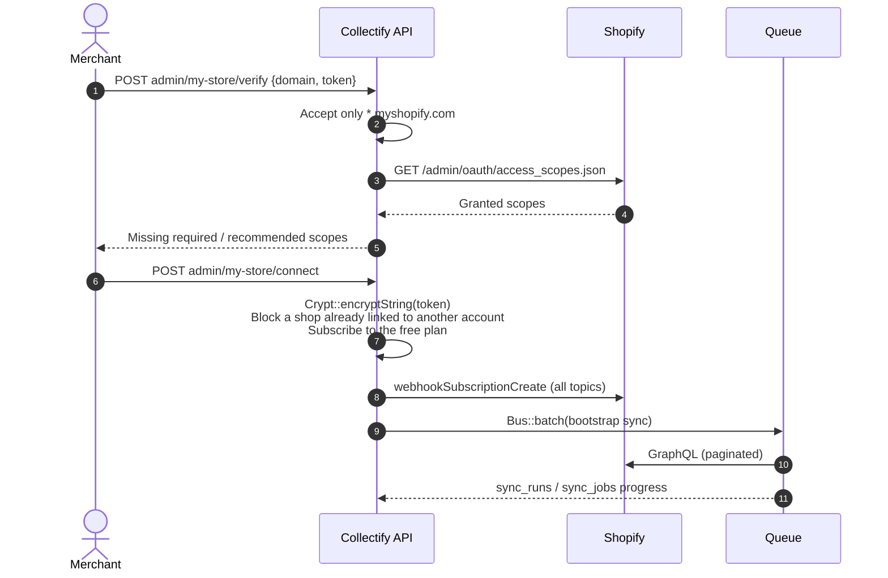
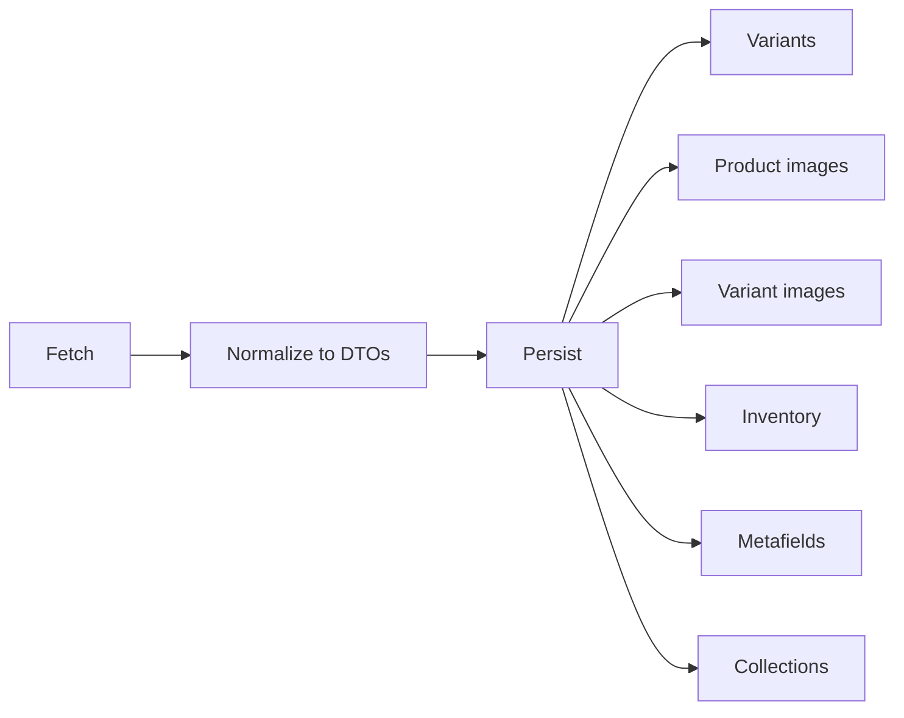
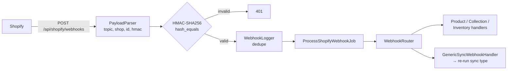
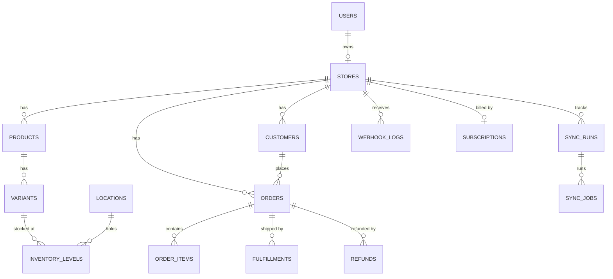

<div align="center">

# Collectify: Backend API

**The Laravel engine behind [Collectify](https://collectify.sbs): it connects a Shopify store, keeps a live mirror of the store's data, and sends edits back to Shopify.**


[Frontend source](https://github.com/mhamdNaser/sydev-front) · [Deployed frontend](https://github.com/mhamdNaser/frugaldomain_front) · [Live site](https://collectify.sbs)

</div>

---

## Contents

- [What it does](#what-it-does)
- [Architecture](#architecture)
- [Shopify integration](#shopify-integration)
- [API overview](#api-overview)
- [Auth and roles](#auth-and-roles)
- [Data model](#data-model)
- [Getting started](#getting-started)
- [Queues and background work](#queues-and-background-work)
- [Environment variables](#environment-variables)
- [Testing](#testing)
- [Project structure](#project-structure)

---

## What it does

Collectify is a SaaS workspace for Shopify merchants. A store owner connects their store once. After that, Collectify:

| For the merchant | How the backend does it |
|---|---|
| **Sees the whole store in one dashboard**: products, orders, customers, inventory, fulfillments, discounts and content | Imports everything through the Shopify Admin **GraphQL** API into a local MySQL mirror (about 115 tables) |
| **Sees changes without refreshing or re-importing** | Receives **verified Shopify webhooks** (about 60 topics) and re-syncs only the affected data |
| **Edits in Collectify and has the edit reach Shopify** | Runs an **outbound sync queue** that is idempotent and retries with backoff |
| **Gets a free plan right away** | Subscribes every newly connected store to the free plan |
| **Can build a mobile storefront** | Serves a public **Mobile API** (catalog, search, checkout through Shopify draft orders) |
| **Uses the product in Arabic or English** | Serves translations from `resources/lang/{ar,en}`, editable from the admin panel |

Platform admins also get SaaS tools: plans and subscriptions, user, role and permission management, first-party site analytics, a sync monitor, webhook and API logs, and a Filament admin panel.

---

## Architecture

The backend is a **modular monolith**. Every business area is a self-contained module in `app/Modules`. Each module has its own routes, migrations, service provider and repository bindings.



**Request path:** `Controller → FormRequest validation → Service → Repository interface → Eloquent → API Resource`

- `routes/api.php` does no routing itself. It globs and loads every `app/Modules/*/Routes/api.php`.
- Each module's `ServiceProvider` (registered in `bootstrap/providers.php`) binds its repository interfaces and calls `loadMigrationsFrom()`.
- Responses use two kinds of API Resource: `*TableResource` for lists and `*DetailResource` for single records.

### Modules

| Module | Responsibility |
|---|---|
| **Shopify** | GraphQL client, 38 sync services, 31 jobs, 47 readonly DTOs, the product pipeline, webhooks, outbound sync |
| **Stores** | Connecting a store, token encryption, store settings and branding, account management |
| **Catalog** | Products, variants, options, media, collections, categories, tags, vendors, types, markets, price lists, selling plans |
| **Orders** | Orders, line items, duties, risks, channels, returns, draft orders, carts, abandoned checkouts |
| **Fulfillment** | Fulfillments, fulfillment orders, tracking, services, reverse fulfillments, exchanges |
| **Inventory** | Locations, inventory levels, inventory movements |
| **Marketing** | Discounts, discount codes, discount usage |
| **CMS** | Files (staged uploads to Shopify), blogs, articles, pages, menus, metafields, metaobjects, themes |
| **Billing** | Plans, features, subscriptions, payment transactions, refunds |
| **Shipping / Tax** | Shipping zones, rates and methods; tax lines and rates |
| **User** | Auth, users, customers, addresses, marketing consent, roles and permissions |
| **Locale** | Languages, countries, states, cities, runtime translation editing |
| **Analytics** | Privacy-friendly visit and page-view tracking, with geo and user-agent parsing |
| **Core** | Dashboard statistics, contact form, image conversion, webhook and API logs, sync metadata |
| **MobileApp** | Public storefront API for mobile clients |
| **Icon / Gesture** | Side features: an SVG and JSX icon library, and gesture capture |

---

## Shopify integration

### 1. Connecting a store

Collectify uses the **custom-app model**, not OAuth. The merchant creates a custom app in their Shopify admin and pastes the shop domain and the Admin API access token.



- **Required scopes:** `read_products`, `read_inventory`, `read_locations`, `read_orders`, `read_customers`
- **Recommended scopes:** drafts, fulfillments, discounts, shipping, content, navigation, files, markets, returns, metaobjects, themes, `write_products`, `write_inventory`

### 2. Inbound sync (Shopify → Collectify)

- `ShopifyClient` uses **GraphQL only**, with API version **`2026-04`**. It uses a 30 s timeout and `retry(3, 500)`, and throws `ShopifySyncException` on failure.
- Every data type has a `*SyncService` and a matching `Sync*Job`.
- Runs are tracked in `sync_runs`, `sync_jobs` and `sync_errors`. The frontend shows this progress live.
- `POST admin/sync/bootstrap` accepts the preset `full_commerce` or `minimal`, or a custom `types[]` list.

Products go through a dedicated pipeline:



### 3. Webhooks (real-time updates)



- The signing secret is stored per store in `stores.shopify_webhook_secret`, with `SHOPIFY_WEBHOOK_SECRET` as the fallback. Set it with `PUT admin/shopify/webhook-secret`.
- About 60 topics are declared in `ShopifyWebhookTopicCatalog`. They cover products, collections, inventory, locations, orders, refunds, transactions, draft orders, fulfillments, customers and more.

### 4. Outbound sync (Collectify → Shopify)

Local edits are queued in `shopify_outbound_syncs`, and every attempt is logged in `shopify_outbound_sync_attempts`.

`pending → processing → synced`, or on failure `retrying → failed → dead` once the retries run out.

```bash
php artisan shopify:outbound-dispatch-due --limit=100
```

Details are in [`app/Modules/Shopify/OutboundSync/README.md`](app/Modules/Shopify/OutboundSync/README.md).

---

## API overview

The base URL is `/api`, and there are about 340 routes. List endpoints use `POST all{Resource}` so they can take filter bodies. Single-record endpoints are REST: `GET|PUT|DELETE {resource}/{id}`.

| Area | Access | Examples |
|---|---|---|
| Auth | public / token | `POST login`, `POST admin/adminregister`, `POST admin/password/forgot`, `GET admin/me` |
| My store | partner | `GET admin/my-store`, `POST admin/my-store/verify`, `…/connect`, `…/sync-status` |
| Sync | partner | `POST admin/sync/bootstrap`, `POST admin/sync/{type}`, `GET admin/sync/outbound` |
| Catalog | partner | products, variants (`variants/price`), collections, vendors, options, tags |
| Orders | partner | orders, draft orders, carts, returns, duties |
| Fulfillment | partner | fulfillments, fulfillment orders, tracking, services |
| Marketing | partner | discounts, codes, usage, markets, selling plans |
| CMS | partner / admin | files (`upload-to-shopify`), blogs, articles, pages, menus, metafields, metaobjects |
| Billing | partner / admin | transactions, refunds · plans and subscriptions (admin) |
| Admin | admin | users, roles, permissions, stores, analytics, statistics |
| Locale | public | `locale/{lang}`, `active-languages`, `countries`, `states/{id}`, `cities/{id}` |
| Mobile | public | `mobile/bootstrap`, `mobile/products`, `mobile/search`, `mobile/checkout/place-draft-order` |
| Webhooks | Shopify HMAC | `POST shopify/webhooks` |

Other endpoints: `GET /up` is the health check, and `/admin` is the Filament admin panel.

---

## Auth and roles

- **Laravel Sanctum** personal access tokens, sent as `Authorization: Bearer <token>`. Logging in revokes the user's previous tokens.
- **spatie/laravel-permission**. The middleware aliases are `role`, `permission` and `role_or_permission`.

| Role | Who | Access |
|---|---|---|
| `admin` | Platform operator | Everything: users, stores, plans, analytics, languages |
| `partner` | Store owner (assigned on self-registration) | Their own store and all of its Shopify data |
| `user` | Basic account | Minimal access |

- Password reset uses a 6-digit code that is stored hashed.
- Store access tokens are encrypted at rest with `Crypt::encryptString`.
- Auth routes are rate limited: 10/min for registration, 20/min for store connection and 60/min for analytics.

---

## Data model

The 115 migrations live inside their modules, in `app/Modules/*/database/migrations`. Key tables:



---

## Getting started

### Requirements

PHP 8.2+, Composer, MySQL 8, Node 20+, and the PHP extensions `gd` or `imagick`, `pdo_mysql` and `openssl`.

### Install

```bash
git clone https://github.com/mhamdNaser/frugaldomain.git
cd frugaldomain

composer install
npm install

cp .env.example .env
php artisan key:generate
# edit DB_* and FRONTEND_URL / CORS_ALLOWED_ORIGINS / SHOPIFY_WEBHOOK_ENDPOINT

php artisan migrate --seed      # roles, admin, languages, free plan, demo data
php artisan storage:link
```

### Run in development

```bash
composer dev        # serve + queue:listen + vite, all at once
```

Or run each part on its own:

```bash
php artisan serve --host=localhost --port=8000
composer queue:shopify          # worker for every Shopify queue
```

> **Receiving webhooks locally:** Shopify has to be able to reach your machine. Expose it with a tunnel (for example ngrok or cloudflared) and set `SHOPIFY_WEBHOOK_ENDPOINT` to `https://<tunnel>/api/shopify/webhooks`.

---

## Queues and background work

All Shopify work runs on the `database` queue connection, split across 17 queues so that a slow sync type doesn't block the others:

```
default, shopify-sync, shopify-outbound, shopify-orders, shopify-customers,
shopify-inventory, shopify-variants, shopify-variant-images, shopify-images,
shopify-collections, shopify-draft-orders, shopify-fulfillments,
shopify-financials, shopify-discounts, shopify-content, shopify-files,
shopify-metafields
```

| Environment | How to run the workers |
|---|---|
| **VPS / Linux** | Supervisor running `php artisan queue:work database --queue=<list above> --tries=3 --timeout=3600` |
| **Shared hosting** | Only a cron entry is needed. The scheduler in `routes/console.php` runs a worker every minute (`--stop-when-empty --max-time=50`): <br/>`* * * * * cd /path && php artisan schedule:run >> /dev/null 2>&1` |
| **Windows** | `scripts/shopify-queue-worker.bat` restarts the worker in a loop. `scripts/install-shopify-queue-worker-task.ps1` registers it as a Scheduled Task that starts at logon. |

After you deploy new code, run `php artisan queue:restart`.

---

## Environment variables

Copy `.env.example`. These are the variables specific to this project:

| Variable | Purpose |
|---|---|
| `FRONTEND_URL` | The dashboard origin. Used in links and CORS. |
| `CORS_ALLOWED_ORIGINS` | Comma-separated origins allowed to call the API |
| `SANCTUM_STATEFUL_DOMAINS` | SPA domains for Sanctum |
| `SHOPIFY_WEBHOOK_ENDPOINT` | Public URL Shopify posts webhooks to |
| `SHOPIFY_WEBHOOK_SECRET` | Fallback HMAC secret (normally set per store) |
| `QUEUE_CONNECTION` | `database` |
| `MAIL_*` | Delivery for contact-form notifications |

No global Shopify API key is needed, because each store brings its own encrypted access token.

---

## Testing

The tests use Pest 3 with in-memory SQLite, the sync queue and the array mailer.

```bash
composer test
# or
php artisan test --filter=MyStoreTest
```

Coverage includes store connection (domain validation, scope checks, token encryption, duplicate-store guard, free plan), webhook HMAC verification, registration and analytics tracking.

---

## Project structure

```
app/
├── Filament/               # Admin panel resources (users, stores, countries, languages, icons)
├── Modules/
│   └── <Module>/
│       ├── Controllers/
│       ├── Models/
│       ├── Providers/      # binds repositories, loads migrations
│       ├── Repositories/{Interfaces,Eloquent}/
│       ├── Requests/       # FormRequest validation
│       ├── Resources/      # API Resources
│       ├── Routes/api.php
│       ├── Services/
│       └── database/{migrations,seeders}/
│   └── Shopify/
│       ├── Actions/  DTOs/  Jobs/  Pipeline/
│       ├── OutboundSync/   Webhooks/  Services/Sync/
├── Traits/                 # ManageFiles, PaginatesCollection
bootstrap/providers.php     # module service providers
config/shopify.php
resources/lang/{ar,en}/     # translations
routes/api.php              # loads every module's routes
routes/console.php          # scheduled queue worker
scripts/                    # Windows queue worker helpers
tests/Feature/
```

---

<div align="center">

Built by **Muhammed Nasser Edden** · [collectify.sbs](https://collectify.sbs)

</div>
